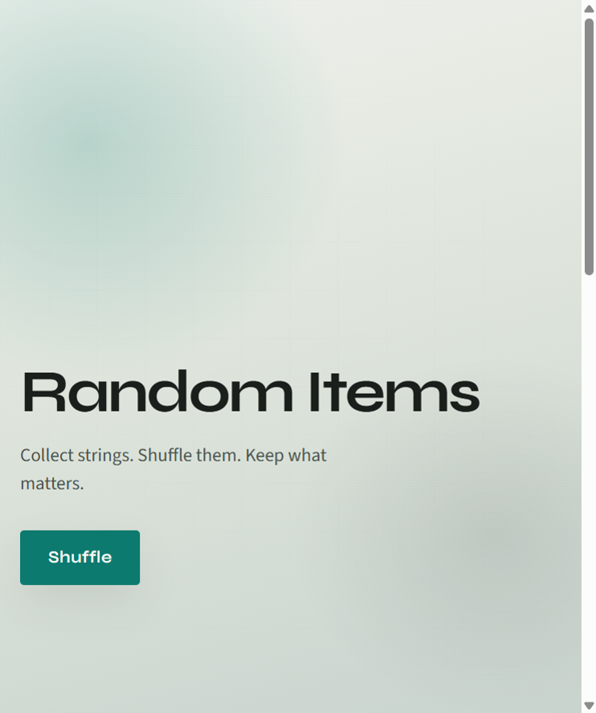

# Random Items

Save short task titles, then shuffle them into a random order.

**Backend:** Python 3.12 · FastAPI · SQLAlchemy · Alembic · SQLite  
**Frontend:** React · TypeScript · Vite



## What it does

- Add, edit, and delete tasks
- Shuffle the collection into a random order
- REST API with docs at `/docs`

The website (React) talks to the API (FastAPI). Locally those are two programs: the API on port 8000, the website on port 5173.

## Evolution

This project is being built in stages — from a simple random-items demo toward a personal task manager. Each step is intentionally small and reviewable.

### Foundation (on `master`)

| Stage | What changed | Link |
|-------|--------------|------|
| 1 | Initial MVP — FastAPI CRUD API + React frontend | [commit](https://github.com/JoshStevens582/random-items/commit/0152865) |
| 2 | Portfolio screenshot and README | [commit](https://github.com/JoshStevens582/random-items/commit/27af5dd) |
| 3 | Backend tests and GitHub Actions CI | [commit](https://github.com/JoshStevens582/random-items/commit/5738572) |
| 4 | Frontend lockfile sync and CI on Node 22 | [commit](https://github.com/JoshStevens582/random-items/commit/91a2155) |
| 5 | Environment-based API config for portable deployment | [commit](https://github.com/JoshStevens582/random-items/commit/4be0250) |
| 6 | Alembic migrations — versioned schema changes without data loss | [PR #1](https://github.com/JoshStevens582/random-items/pull/1) |
| 7 | Refactor Item → Task domain (`content` → `title`, `/items` → `/tasks`) | [PR #2](https://github.com/JoshStevens582/random-items/pull/2) |

### Planned (task manager)

| Stage | What changed |
|-------|--------------|
| 8 | Task status workflow (`todo`, `in_progress`, `done`) |
| 9 | Priority and due dates |
| 10 | Task dashboard UI (filters, badges, replace shuffle flow) |
| 11 | Notes, `updated_at`, and polish |

From stage 8 onward, each step will be its own branch → PR → merge.

## Run locally

You do **not** need a `.env` file on your machine. Defaults already match this setup.

### Requirements

- Python 3.12+
- [uv](https://docs.astral.sh/uv/)
- Node.js 20+

### Install

```bash
uv sync

cd frontend
npm install
cd ..
```

### Start (two terminals)

**Terminal 1 — API** at http://127.0.0.1:8000

```bash
uv run alembic upgrade head
uv run random-items
```

If `items.db` already exists from before Alembic (the old `create_all` path), stamp it instead of running the first migration:

```bash
uv run alembic stamp head
```

**Terminal 2 — website** at http://127.0.0.1:5173

```bash
cd frontend
npm run dev
```

Open http://127.0.0.1:5173 in your browser.

Interactive API docs: http://127.0.0.1:8000/docs

## Configuration (optional)

The API can run on another machine without editing Python. Copy `.env.example` to `.env` and set values for **that** machine.

| Variable | Local default | What it is |
|----------|-----------------|------------|
| `DATABASE_URL` | SQLite file `items.db` in this repo | Where tasks are stored |
| `CORS_ORIGINS` | `http://127.0.0.1:5173`, `http://localhost:5173` | Which website may call the API |
| `HOST` / `PORT` | `127.0.0.1:8000` | Where the API listens |
| `ENV` | `development` | Use `production` to turn reload off |
| `APP_TITLE` | `Random Tasks API` | API title in `/docs` |

If the website should call an API that is not `http://127.0.0.1:8000`, copy `frontend/.env.example` to `frontend/.env` and set `VITE_API_BASE_URL`.

## Tests

```bash
uv sync --group dev
uv run pytest
```

GitHub Actions runs backend tests and a frontend production build on every push and pull request to `master`.

## API

| Method | Path            | Description                          |
|--------|-----------------|--------------------------------------|
| POST   | `/tasks`        | Create a new task                    |
| GET    | `/tasks`        | List all tasks                       |
| GET    | `/tasks/random` | All task titles in randomized order  |
| GET    | `/tasks/{id}`   | Get a single task by ID              |
| PUT    | `/tasks/{id}`   | Update a task                        |
| DELETE | `/tasks/{id}`   | Delete a task                        |
| GET    | `/health`       | Health check                         |

```bash
curl -X POST http://127.0.0.1:8000/tasks -H "Content-Type: application/json" -d "{\"title\": \"apple\"}"
curl http://127.0.0.1:8000/tasks/random
```

## Project layout

```
src/random_items/   FastAPI app
alembic/            Database migrations
frontend/           React website
tests/              API tests
.env.example        API settings you can override on another machine
```
